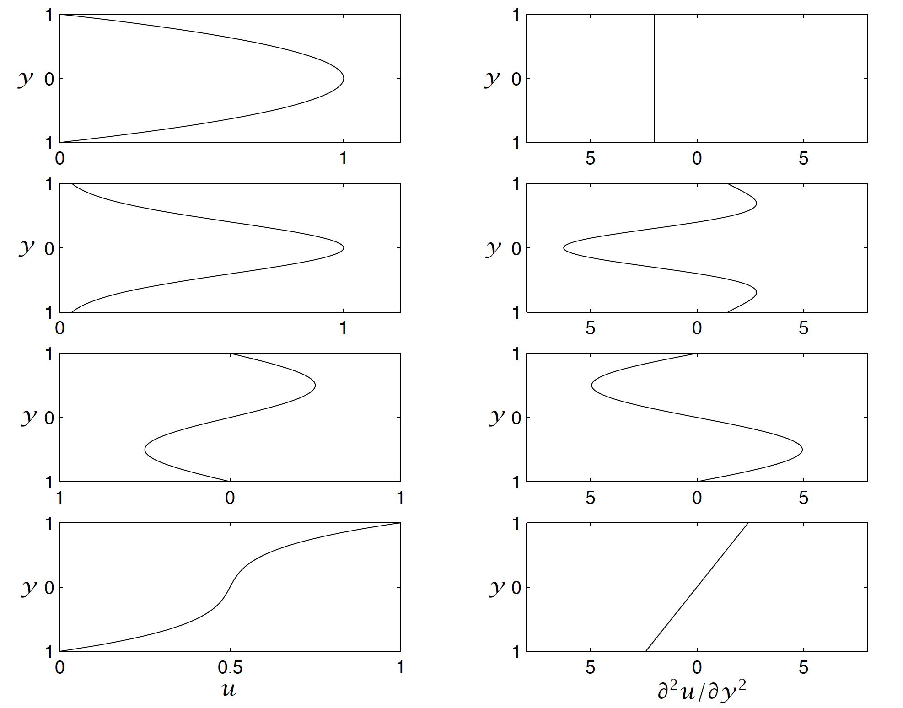

## Problem Set 4. Available Potential Energy and Instability

In this exercise, we will look at how available potential energy (APE) responds to global warming by examining simulations using the Community Earth System Model (CESM). 

### Problem 1. Mean Lapse Rate (5 points)

Two Southern Hemisphere temperature datasets are provided. One is a `historical` simulation for 1897 to 1899, and the other is the simulation of 2097-2099 under the SSP5-8.5 scenario. Please complete the code below and answer the following question,
* _Do you think the mean lapse rate for the warmed climate and the current climate are significantly different? How large error (in terms of percentage) may be introduced by using the mean lapse rate profile for 1897-1899 in estimating the APE of 2097-2099?_
\[Hint: you can certainly do detailed calculations to find out the error. However, here I wish you to estimate the relative error by comparing the two lapse rate profile and using the definition of APE (Equation 18 on class slides) \]

```
%% Southern Hemisphere Available Potential Energy
%% Task 1: Compute mean lapse rate in historical and future climate
% Read data
ta18 = ncread('ta_day_CESM2_historical_r11i1p1f1_gn_18970101-18991231_SH.nc', 'ta');
ta20 = ncread('ta_day_CESM2_ssp585_r1i1p1f1_gn_20970101-209912301_SH.nc', 'ta');

% Calculate mean lapse rate. Lapse rate in fact is not a function of pressure only, but here let's assume it is.
lat = ncread('ta_day_CESM2_historical_r11i1p1f1_gn_18970101-18991231_SH.nc', 'lat');
clat = reshape(cosd(lat), 1, 96);  % weight data by cos(lat)
clat = repmat(clat, 1, 1, 8);  % make clat the same shape as ta18m and ta20m below

% Average over longitude and time
[FILL YOUR CODE HERE, SAVE TO 'ta18m' AND 'ta20m']

% Average over latitude
clat(isnan(ta18m)) = NaN;   % set weight for points underground as NaN
[FILL YOUR CODE HERE, SAVE TO 'ta18m' AND 'ta20m']

% Find out height of each layer 
plev = ncread('ta_day_CESM2_historical_r11i1p1f1_gn_18970101-18991231_SH.nc', 'plev');
% assuming the scale height is 7.6km, find the geopotential height of each
% level
zlev = 7600.0 * log(100000.0 ./ plev);
zlev = reshape(zlev, size(ta18m));  % reshape it for later convenience in broadcasting

% Calculate mean lapse rate now, using the difference between adjacent levels to approximate
[FILL YOUR CODE HERE]

zhalf = 0.5 * (zlev(1:7) + zlev(2:8));  % height at half levels

% Plot the lapse rate
f1 = figure;
plot(squeeze(Gamma18(:))*1000.0, squeeze(zhalf)/1000.0, 'b-o', ...
     squeeze(Gamma20(:))*1000.0, squeeze(zhalf)/1000.0, 'r-o')
xlabel('lapse rate (K/km)')
ylabel('height (km)')
legend('1897-1899', '2097-2099')
% We can use the lowest 4 (half) levels only, because the 5th is already
% above tropopause.

% Estimate overestimation/underestimation that may be introduce by using the mean lapse
% rate of one climate for both.
[FILL YOUR CODE HERE, SAVE RELATIVE ERROR ESTIMATION TO 'err']

fprintf('If we use the historical climate profile, error in APE is: %5.1f %%\n', err)
```

### Problem 2. The Change in APE (5 points)

Complete the code below to plot time series of APE in the historical period and future period. Answer the following questions.
* _Which seasons have the lowest and highest APE?_
* _Do you see significant increase or decrease in APE due to global warming? What physical process do you think causes such a change?_ 
[Hint: Think about how APE is generated to answer this question]

```
%% Task 2: Compuate available potential energy
% get half level mean temperature and perturbation (T'') of the lowest 4 levels
ta18mh = 0.5 * (ta18m(:, :, 1:4) + ta18m(:, :, 2:5));
ta20mh = 0.5 * (ta20m(:, :, 1:4) + ta20m(:, :, 2:5));
[FILL YOUR CODE HERE, SAVE THE PERTURBATION COMPONENTS TO 'ta18p' and 'ta20p']


Gamma1820 = 0.5 * (Gamma18 + Gamma20);   
% use this mean lapse rate profile for calculation

% compute APE at each grid cell, do not average/sum yet
[FILL YOUR CODE HERE, SAVE THE RESULTS TO 'ape18h' and 'ape20h']


% set the latitude weight
clat = reshape(cosd(lat), 1, 96);  % weight data by cos(lat)
clat = repmat(clat, 1, 1, 4);      % make clat the same shape as ta18mh and ta20mh
% Average over longitude
ape18m = nanmean(ape18h, 1);  
ape20m = nanmean(ape20h, 1);

clat(isnan(ape18m(:,:,:,1))) = NaN;   % set weight for points underground as NaN
% Average over latitude
ape18m = nansum(clat.*ape18m, 2) ./ nansum(clat, 2);
ape20m = nansum(clat.*ape20m, 2) ./ nansum(clat, 2);
% Integrate in the vertical
dp = reshape(plev(1:4) - plev(2:5), 1, 1, 4);
ape18 = sum(ape18m .* dp, 3); 
ape20 = sum(ape20m .* dp, 3);
% Remove singleton dimensions 
ape18 = squeeze(ape18);
ape20 = squeeze(ape20);

% Plot the time series of APE
time = (1:length(ape18))' / (365.0/12.0) + 1;
f2 = figure;
plot(time, ape18, 'b-', time, ape20, 'r-')
ylabel('APE (J m^{-2})')
xlabel('time (month)')
legend('1897-1899', '2097-2099')
xlim([1, 37])
% Let's filter sub-monthly variability by taking the moving average
ape18 = movmean(ape18, 30);
ape20 = movmean(ape20, 30);
f3 = figure;
plot(time, ape18, 'b-', time, ape20, 'r-')
ylabel('APE (J m^{-2})')
xlabel('time (month)')
legend('1897-1899', '2097-2099')
xlim([1, 37])
```

### Basic Concept Questions (5 points)

(1) Is the cloud in the picture below due to convective instability or Kelvin-Helmholtz instability?


(2) The four rows below represent different configurations of two-dimensional flows. Which one cannot have barotropic instability according to Reyleigh's criterion? 


(3) Can a two-dimensional flow have baroclinic instability? Why or why not?

(4) Is the deformation radius larger in the atmosphere or the ocean? Why?

(5) In the Eady's problem, the cutoff wavelength is 2.6L<sub>d</sub>. If the deformation radius is 1000km, can the waves with a wavelength around 800km be unstable due to baroclinic instability? Why?

